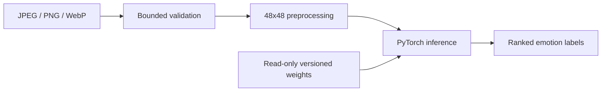

# Facial Emotion Recognition System

[](https://github.com/CoreyLeath-code/Facial-Emotion-Recognition-System/actions/workflows/ci.yml)
[](https://github.com/CoreyLeath-code/Facial-Emotion-Recognition-System/actions/workflows/codeql.yml)
[](LICENSE)

A PyTorch/FastAPI service for seven-class facial-expression classification on FER-style 48x48 grayscale inputs. The supported production boundary validates uploaded images, loads reviewed state dictionaries, and exposes separate liveness and readiness probes.

> Facial expressions do not reliably reveal internal emotional state. This project is for research and demonstration, not medical diagnosis or consequential decisions.

## Architecture



## Quick start

```bash
python -m venv .venv
source .venv/bin/activate  # Windows: .venv\Scripts\activate
pip install -e ".[dev]"
pytest
```

Run the API after placing reviewed weights at `artifacts/models/emotion_model.pt`:

```bash
pip install -e .
uvicorn src.api.main:app --host 0.0.0.0 --port 8000
curl http://localhost:8000/health/live
curl http://localhost:8000/health/ready
```

## Metrics dashboard

| Metric | Verified value |
|---|---:|
| Supported Python | 3.10-3.12 |
| Emotion classes | 7 |
| Input upload limit | 5 MiB default |
| Hardened boundary tests | 19 passing |
| Hardened boundary coverage | 100% branch coverage |
| Validation median latency | 92 microseconds (local) |
| Model accuracy | Pending reproducible evaluation |
| Inference latency/throughput | Pending versioned weights benchmark |
| Security findings | Published by CI |
| Docker image size | Published by CI/build system |

## Engineering controls

Pull requests run scoped formatting/linting, strict typing, tests and coverage, package/container builds, dependency and static security audits, secret scanning, license inventory, SBOM generation, CodeQL, and a reproducible benchmark. Optional profiles keep dashboard, training, vision, and LLM dependencies out of the minimal API installation.

## Documentation

- [Production audit](docs/AUDIT.md)
- [Deployment guide](docs/DEPLOYMENT.md)
- [Benchmark methodology](docs/BENCHMARKING.md)
- [Model card](MODEL_CARD.md)
- [Security and threat model](SECURITY.md)
- [Ethics](ethics.md)

See the audit before using legacy Streamlit, Kubernetes, Helm, Airflow, Snowflake, MLflow, RAG, or LLM prototypes.
