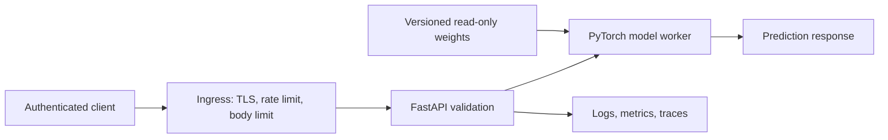

# Production Readiness Audit

Date: 2026-07-17

## Executive summary

The repository demonstrates broad computer-vision and MLOps concepts, but its pre-audit state was not deployable: dependency declarations described TensorFlow while runtime code used PyTorch; package layout and entrypoints were duplicated; the container launched a nonexistent dashboard path; Kubernetes and Helm described ports and GPU resources not provided by the image; API uploads were unbounded; CORS was unrestricted; and benchmark claims lacked machine-readable evidence.

This pass defines the supported production unit as the FastAPI/PyTorch inference service. Training, notebooks, Streamlit, MLflow, Snowflake, Airflow, RAG, and LLM explanation remain optional profiles until each has an owner, SLO, data contract, and threat model.

## Strengths

- Small explainable CNN and optional ResNet architecture.
- Explicit seven-class FER label map and model card.
- CPU/GPU device selection and evaluation-mode inference.
- Existing dataset, evaluation, streaming, API, and deployment prototypes.

## Risks and treatment

| Priority | Risk | Impact | Treatment |
|---|---|---|---|
| P0 | Dependencies did not match imports | Builds fail or silently diverge | Canonical PEP 621 packaging with optional profiles |
| P0 | Arbitrary/unbounded uploads | Memory exhaustion and parser attacks | Type, byte, decode, and dimension validation |
| P0 | Unrestricted model deserialization | Code execution from untrusted artifacts | `weights_only=True`; mount reviewed weights read-only |
| P0 | False-green CI and unverifiable metrics | Unsafe releases and misleading claims | Fail-closed CI, coverage gate, artifacts, reproducible benchmark |
| P1 | Wildcard CORS and no authentication | Cross-origin abuse and unauthorized inference | Origin allowlist; authentication remains required before Internet exposure |
| P1 | Liveness reported healthy without a model | Traffic routed to unusable pods | Separate `/health/live` and `/health/ready` |
| P1 | Duplicate source/application layouts | High change risk | Freeze legacy entrypoints; migrate incrementally to one package |
| P1 | Emotion inference can be treated as mental-state truth | Ethical and product harm | Prominent limitations; prohibit consequential decisions |
| P2 | Kubernetes/Helm manifests are inconsistent | Failed or insecure deployment | Do not deploy until regenerated from the supported API contract |

## Architecture and scale

One process owns one model instance. Scale replicas horizontally only after measuring memory and accelerator contention. Batch inference is preferable for offline evaluation; interactive endpoints should use bounded concurrency and backpressure.

## Prioritized roadmap

1. Publish a signed, versioned model artifact with checksum, lineage, license, and evaluation dataset identifier.
2. Add authentication, per-principal quotas, structured audit logging, and ingress rate/body limits.
3. Consolidate `src/` and `src/src/`, then raise whole-package coverage rather than the hardened boundary coverage.
4. Re-run accuracy, per-class precision/recall/F1, calibration, confusion matrix, and subgroup analysis on a versioned held-out corpus.
5. Regenerate Helm/Kubernetes resources, add network policy, pod security context, autoscaling, monitoring, and rollback rehearsal.

## Release criteria

- Formatting, lint, strict typing, tests, coverage, package, container, benchmark, CodeQL, dependency, secret, license, and SBOM checks pass.
- Readiness returns 200 only with reviewed weights loaded.
- Model and dataset lineage are immutable and reproducible.
- No deployment uses facial emotion output for medical, employment, education, policing, insurance, or access decisions.
